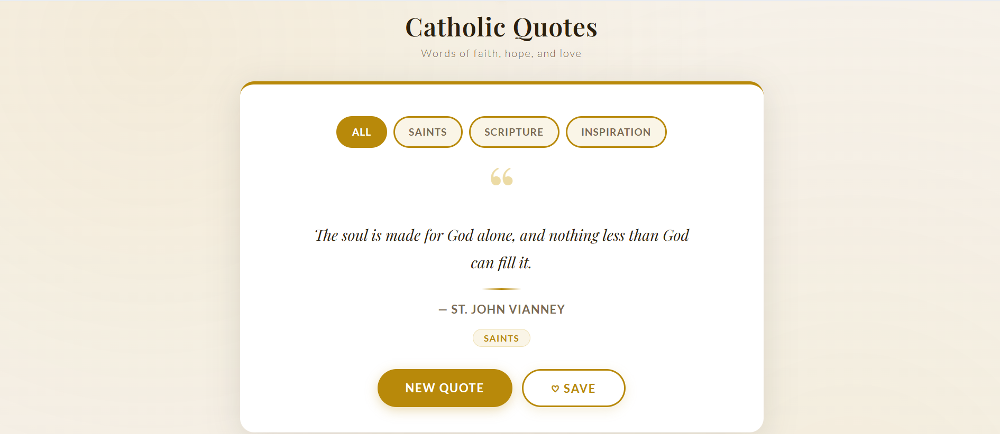
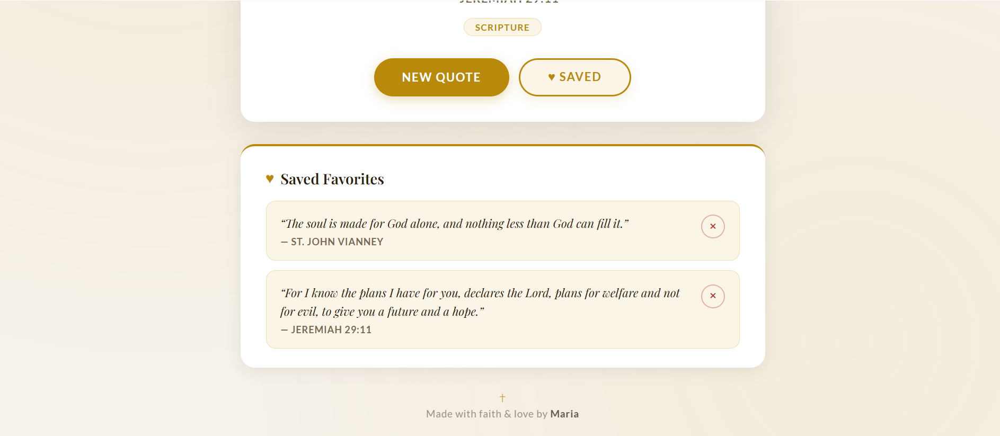

# Catholic Quote Generator

A clean, elegant web app that displays inspiring Catholic quotes from saints, scripture, and tradition. Built with vanilla HTML, CSS, and JavaScript (no frameworks, no dependencies.)

---

## Description

The Catholic Quote Generator presents a beautifully styled quote card on every visit. Users can cycle through quotes, filter by category, save their favorites, and return to them anytime — all without an account or internet connection beyond the initial font load.

---

## Features

- **Random quote on load** — a new quote is shown every time the page opens
- **New Quote button** — generates a fresh quote with a smooth fade animation
- **Category filter** — browse by Saints, Scripture, or Inspiration
- **Save favorites** — bookmark quotes with one click; saved quotes persist across sessions using `localStorage`
- **Remove favorites** — delete individual saved quotes from the favorites list
- **Mobile responsive** — fully usable on phones, tablets, and desktops

---

## Tech Stack

| Technology | Use |
|---|---|
| HTML5 | Structure and semantic markup |
| CSS3 | Layout, animations, responsive design |
| JavaScript (ES6) | Quote logic, DOM manipulation, favorites |
| localStorage | Persisting saved quotes across page reloads |

---

## How to Run

No build tools or server required.

1. Clone or download this repository
2. Open `index.html` in any modern browser

```bash
git clone https://github.com/your-username/catholic-quote-generator.git
cd catholic-quote-generator
open index.html
```

That's it — the app runs entirely in the browser.

---

## Screenshots

### Quote card with category filters


### Saved favorites section on mobile


---

## What I Learned

- Strengthened my understanding of using **localStorage** to persist data without relying on a backend
- Reinforced my ability to build clean, polished interfaces using vanilla CSS, including flexbox, transitions, and responsive design techniques
- Improved how I structure JavaScript by organizing code into clear, focused functions for better readability and maintainability
- Gained more experience designing for mobile, focusing on layout adjustments, readability, and touch-friendly interactions

---

## Future Improvements

- Add a **share button** to copy a quote to the clipboard or share via social media
- Include a **daily quote** feature that automatically shows a different quote each day
- Expand the quote library and add subcategories (e.g., Marian quotes, liturgical seasons)
- Add a **search** or keyword filter
- Improve animations with smoother cross-fade transitions between quotes

---

## Project Structure

```
catholic-quote-generator/
├── index.html      — page structure and layout
├── styles.css      — all styling and responsive rules
├── script.js       — quotes data, favorites logic, DOM updates
└── README.md
```

---

*Made with faith and love by Maria*
